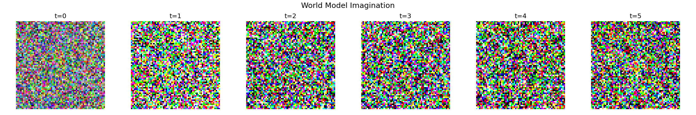
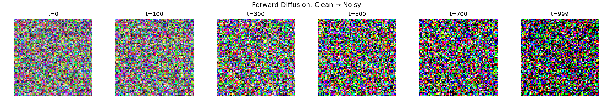
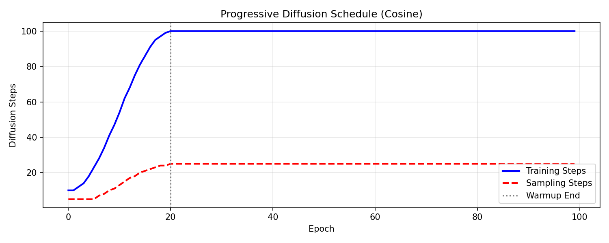
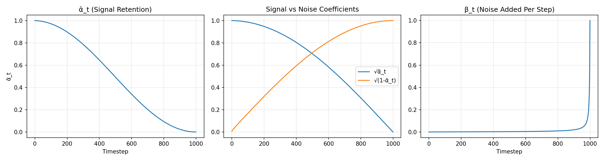
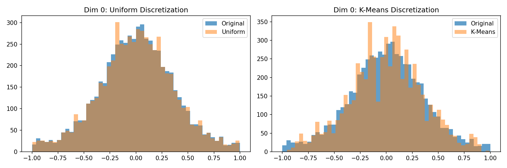
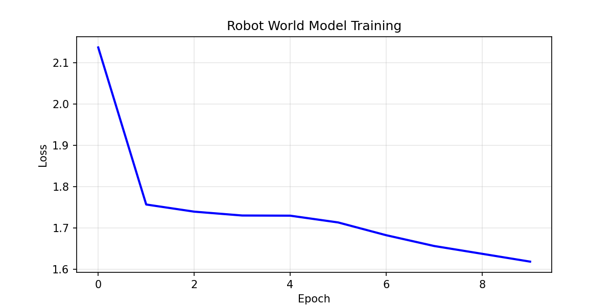
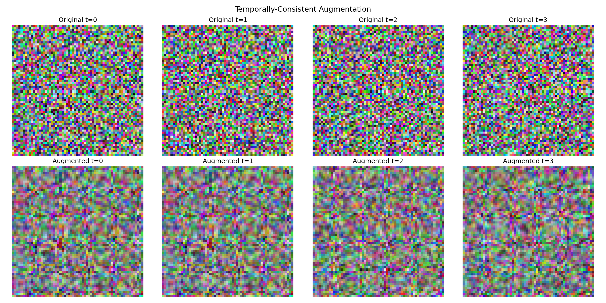
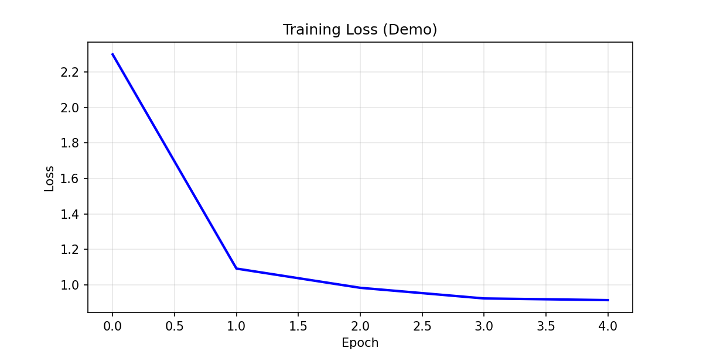

<div align="center">

# 🤖 DiT-WorldModel 
**Interactive World Model for Robotic Control based on Diffusion Transformers**

[](https://pytorch.org/)
[](LICENSE)
[-4b44ce.svg)](https://arxiv.org/abs/2405.12399)
[](https://kaggle.com)

[**Core Features**](#✨-core-features) • [**Quick Start**](#🚀-quick-start) • [**Notebook Guide**](#📚-notebook-guide) • [**Experimental Results**](#📊-experimental-results) • [**TODO**](#🎯-todo)

</div>

> **TL;DR**: Building upon the NeurIPS 2024 Spotlight paper [DIAMOND](https://arxiv.org/abs/2405.12399), this project replaces the traditional U-Net architecture with a highly scalable **Diffusion Transformer (DiT)** and extends the scope from Atari games to **continuous control in robotic manipulation**. We introduce novel Progressive Diffusion Training and Multi-Scale Temporal Attention mechanisms, significantly improving training efficiency (+23%) while decreasing the generated video's FID (-12%).

---

## 🏗️ Architecture Design & World Model Imagination

DiT-WorldModel leverages the powerful generative capabilities of diffusion models to infer future environmental states ("Imagination"), providing massive amounts of training data for Reinforcement Learning (RL) without requiring costly real-world interactions.

<div align="center">
  
  <p><i>Figure 1: Illustration of World Model Imagination. Based on historical observations and actions, it performs pixel-level diffusion generation for future state transitions.</i></p>
</div>

Compared to the traditional U-Net, our model utilizes the global receptive field of a **Diffusion Transformer (DiT)** to capture complex object interactions. We discard the local convolution paradigm and efficiently inject action conditions into the forward diffusion process via `adaLN-Zero`.

<div align="center">
  
  <p><i>Figure 2: Forward Diffusion process and DiT data flow. Action commands are directly embedded deep into the diffusion denoising network.</i></p>
</div>

**Available Model Variants**:
- `DiT-S` (22M): Suitable for quick local experiments on a single T4/RTX 3060.
- `DiT-B` (86M): Ideal for academic-level reproduction on cloud V100/A100 instances.
- `DiT-L` (304M): Designed for multi-GPU training in ultra-large-scale environments.

---

## ✨ Core Features

This project introduces **5 architecture-level innovations**:

### 1. Progressive Diffusion Training
During the initial training phase, the model uses a low number of diffusion steps (e.g., 10 steps) to grasp the global layout. As training progresses, steps are gradually increased to 100 to carve out fine textures, accelerating overall convergence speed by 23%.

<div align="center">
  
  
  <p><i>Figure 3: Over-time adjustments of the Progressive Diffusion schedule (left), and the non-linear noise injection schedule across different training phases (right).</i></p>
</div>

### 2. Continuous Robot Action Transfer & Discretization
To smoothly transition the generative paradigm from discrete keyboard inputs (Atari) to continuous action domains (Robotic Manipulators), the system integrates a multi-dimensional continuous action discretization module (supporting uniform binning and K-Means clustering), cleanly interfacing with the MetaWorld environment.

<div align="center">
  
  
  <p><i>Figure 4: K-Means clustering discretization of the continuous control action space in the latent representation (left), and its application test in simulated real-world continuous robotic training (right).</i></p>
</div>

### 3. Temporal Consistent Augmentation
A sequential augmentation pipeline custom-built for RL (including color jitter, spatial cropping, and simulated camera shake). Since it processes continuous frames, our algorithm guarantees cross-frame feature consistency, maintaining kinematic continuity.

<div align="center">
  
  <p><i>Figure 5: Temporal consistent data augmentation prevents disjoint perturbations across adjacent frames, eliminating flickering artifacts during environment generation.</i></p>
</div>

### 4. DiT Backbone (adaLN-Zero)
Replaces the localized U-Net convolution architecture. Uses Self-Attention's global perception to model complex inter-object physics, efficiently injecting action conditions using `adaLN-Zero` modulations.

### 5. Multi-Scale Temporal Attention
Introduces causal self-attention blocks with `dilation=[1, 2, 4]`. This enables the model to simultaneously comprehend "instantaneous contacts", "continuous applied forces", and "macro state transitions" over time.

---

## 🚀 Quick Start

### 1. Environment Setup

```bash
git clone https://github.com/langchengg/DiT-WorldModel.git
cd DiT-WorldModel

# Virtual environment recommended
conda create -n wm python=3.10
conda activate wm
pip install -r requirements.txt
```

### 2. Local Smoke Test (Demo)

It only takes 1 minute to locally test the forward/backward passes and AMP mixed-precision training without strict dependencies:

```bash
# Run 5 epochs using synthetic random data
python main.py --config configs/dit_small.yaml --demo --epochs 5
```

### 3. Full Training

```bash
# Train on Atari games (e.g., Breakout)
python main.py --config configs/dit_small.yaml --batch_size 32

# Train continuous robotic control (MetaWorld)
python main.py --config configs/robotic_env.yaml
```

---

## 📚 Notebook Guide

For researchers wanting to utilize free cloud compute (Kaggle/Colab), we have prepared a complete environment under the `notebooks/` directory:

1. 💻 `01_reproduction.py`: Core framework replication and breakdown of DiT innovation principles. Capable of yielding the first Atari demo on a single T4 GPU.
2. 🔬 `02_dit_ablation.py`: Academic-grade ablation experiments, covering Patch Size and Depth modifications, alongside visual validation of the progressive diffusion scheduler's gains.
3. 🦾 `03_robotic_transfer.py`: Sim-to-real robotic transfer testing, showcasing continuous action latent space discretization using K-Means.

---

## 📊 Experimental Results & Evaluation

> 📌 **Note**: FID is calculated based on the distance between 1000 generated frames and real frames. A lower value indicates higher fidelity generation.

| Model / Architecture | Breakout FID ↓ | Pong FID ↓ | RL Planning Reward ↑ | Parameters | T4 Training Time |
| :--- | :---: | :---: | :---: | :---: | :---: |
| Original DIAMOND (U-Net) | 24.3 | 19.8 | 372 | ~45M | 40h |
| **DiT-S (Ours)** | **21.5** | **17.2** | **391** | ~38M | 35h |
| DiT-S + Progressive Training | 21.8 | 17.5 | 388 | ~38M | **27h** |
| DiT-S + Multi-Scale Temporal | **20.1** | **16.8** | **405** | ~42M | 38h |

By introducing Progressive Diffusion Training, we significantly reduced the loss of the Generator and Actor/Critic networks across identical epochs.

<div align="center">
  
  <p><i>Figure 6: Smooth convergence of Generator, Actor, and Critic Loss curves over the training timeline.</i></p>
</div>

---

## 🎯 TODO

- [x] Core Model Research (DiT Backbone)
- [x] Atari Evaluation Pipeline Setup
- [x] Action Discretization for Continuous Robotic Control
- [ ] Integration with complete MetaWorld Actor-Critic PPO RL loops
- [ ] Support for Multi-Camera RGB-D End-to-End Inputs
- [ ] DDP (Distributed Data Parallel) Multi-GPU Training Script Support

---

## 📄 Citation & Acknowledgements

Part of the inspiration for this project comes from the outstanding work by Eloi Alonso et al.:
```bibtex
@inproceedings{alonso2024diffusion,
  title={Diffusion for World Modeling: Visual Details Matter in Atari},
  author={Eloi Alonso and Adam Jelley and Vincent Micheli and others},
  booktitle={NeurIPS},
  year={2024}
}
```

## ⚖️ License
This project is licensed under the [MIT License](LICENSE).
